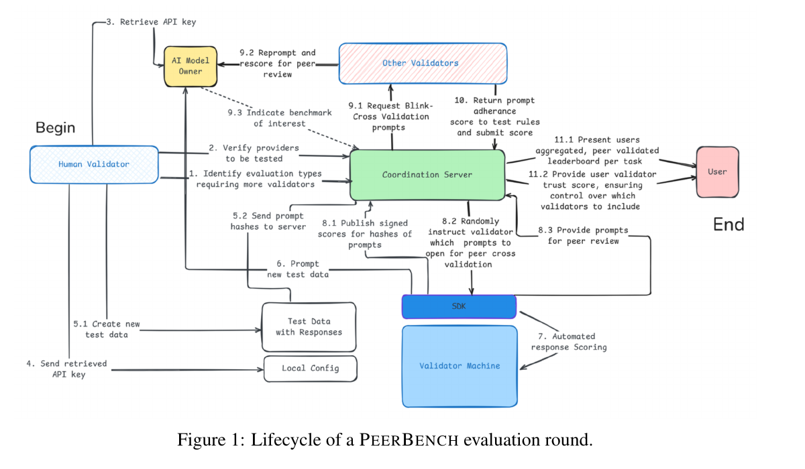

# PeerBench

<a href="https://www.npmjs.com/package/peerbench"></a>
<a href="https://peerbench.ai"></a>
<a href="https://arxiv.org/abs/2510.07575"></a>

<a href="https://discord.gg/dwnyEzZnFr"></a>

> **Tamper-proof AI evaluation: secret tests, sealed execution, and community-verified scores.**

---

## Table of Contents

1. [TL;DR](#tldr)
2. [Join the Community](#join-the-community)
3. [Problem](#problem)
4. [Solution](#solution)
5. [Value](#value)
6. [Architecture](#architecture)
7. [Security & Audit](#security--audit)
8. [Governance & Metrics](#governance--metrics)
9. [Contributing](#contributing)
10. [Appendix: Design Notes](#appendix-design-notes)

---

## TL;DR

PeerBench is a **proctored, live evaluation platform** where AI models are tested against continuously renewed secret datasets, scored by reputation-weighted validators, and ranked on publicly auditable leaderboards. The system prevents benchmark gaming through cryptographic commitments, sealed execution environments, and economic penalties for misconduct. Think of it as the SAT/GRE proctoring paradigm applied to AI—rigorous, fair, and independently verifiable.

---

## Join the Community

Get involved with PeerBench — whether you're a researcher, developer, or AI enthusiast:

| Resource                | Link                                                                                                                | Description                                            |
| ----------------------- | ------------------------------------------------------------------------------------------------------------------- | ------------------------------------------------------ |
| 🌐 **Web App**          | [peerbench.ai](https://peerbench.ai)                                                                                | Submit prompts, review tests, and explore leaderboards |
| 💻 **GitHub**           | [github.com/peerbench/peerBench](https://github.com/peerbench/peerBench)                                            | Source code, issues, and discussions                   |
| 💬 **Discord**          | [Join our Discord](https://discord.gg/kMa6vqHXZH)                                                                   | Chat with the community, ask questions, get support    |
| 📖 **Onboarding Guide** | [Getting Started](https://docs.google.com/document/d/1Wj7o3pAjqMSYy9pHeRXzvm24H3ByYgz7HRxjV67nnQM/edit?usp=sharing) | Step-by-step instructions for new contributors         |

---

## Problem

Public AI benchmarks are fundamentally broken. Test sets inevitably leak into training corpora—research shows over 45% overlap on major QA benchmarks and GPT-4 inferring masked MMLU answers 57% of the time, well above chance [[Deng et al., 2024]](https://arxiv.org/abs/2311.09783). Model developers can cherry-pick favorable subsets, train directly on test data, or engineer heuristics that inflate scores without genuine capability gains. This "Wild West" of evaluation makes distinguishing real progress from manufactured leaderboard positions nearly impossible, eroding scientific signal and public trust in AI advancement claims.

## Solution

PeerBench implements a **proctored exam paradigm** for AI evaluation. Secret test items are held in a rolling reservoir, revealed only during sealed execution, and retired after use to prevent contamination. Contributors submit tests with cryptographic commitment hashes; reviewers validate quality before items enter the live pool. Model scores are computed as reputation-weighted averages, where test weights combine peer-reviewed quality scores and contributor track records. Misconduct triggers automatic collateral slashing, creating economic alignment with honest participation.

## Value

For **researchers**, PeerBench provides contamination-resistant benchmarks that measure genuine generalization, enabling credible capability claims and reproducible comparisons. For **decision-makers**, it offers trustworthy signals for procurement, deployment, and risk assessment—analogous to how credit rating agencies provide reliable financial assessments. For the **AI ecosystem**, it establishes a neutral, community-governed standard that restores integrity to evaluation, accelerating authentic progress while exposing hype. The system is designed to be a complementary "certificate-grade" layer alongside open benchmarks, not a replacement.

---

## Architecture



**Actors and Data Flow:**

| Actor                   | Role                                                                                            |
| ----------------------- | ----------------------------------------------------------------------------------------------- |
| **Contributors**        | Submit test items, scoring functions, and commitment hashes                                     |
| **Coordination Server** | Orchestrates evaluation rounds, manages the reservoir, publishes signed scores                  |
| **Live Reservoir**      | Holds active secret test items (size `k`); oldest/lowest-weight items are retired and published |
| **Reviewers**           | Rate test quality; earn reputation through consensus correlation                                |
| **Model Endpoints**     | AI models under evaluation                                                                      |
| **Public Leaderboard**  | Displays aggregated, peer-validated rankings with full audit trails                             |

The workflow proceeds: Contributors → Commitment → Review → Reservoir → Sealed Execution → Scoring → Leaderboard. Retired tests become public, enabling longitudinal contamination audits.

---

## Security & Audit

### Cryptographic Guarantees

- **Commitment Hashing**: Contributors submit hash commitments before tests enter review. The hash is published; content remains sealed until execution or retirement.
- **Sealed Execution**: Model inference runs in isolated SDK environments with no network egress; prompts are never exposed to model owners before scoring.
- **Partial Revelation for Review**: Reviewers see only metadata and sampled items sufficient for quality assessment, not full test content.

---

## Governance & Metrics

### Leaderboards Maintained

| Leaderboard                 | Purpose                                                            |
| --------------------------- | ------------------------------------------------------------------ |
| **Contributor Leaderboard** | Ranks test creators by cumulative quality and verification bonuses |
| **Reviewer Leaderboard**    | Ranks validators by consensus alignment on quality assessments     |
| **Model Leaderboard**       | Ranks AI models by reputation-weighted evaluation scores           |

### Scoring Formulas

**Contributor Score** — cumulative test quality plus verification bonuses:

```
ContributorScore(c) = Σ quality(T_i^(c)) + bonuses
```

**Reviewer Score** — Pearson correlation between individual ratings and consensus:

```
ReviewerScore(r) = Pearson({q(i)_r}, {q(i)})
```

**Model Score** — reputation-weighted average of per-test scores:

```
ModelScore(m) = (Σ_i w(T_i) × s_i(m)) / (Σ_i w(T_i))
```

**Test Weight** — combines peer-reviewed quality and contributor reputation:

```
w(T) = max{0, 0.7 × quality(T) + 0.3 × min(2, ρ_c / 100)}
```

> [!NOTE]  
> If you want to contribute to this algorithm please check this discusion: [link](https://github.com/peerbench/peerBench/discussions/29).

---

## Contributing

### To the Codebase

We welcome code contributions via pull requests. To contribute:

1. Fork the repository and create a feature branch
2. Make your changes following the existing code style and conventions
3. Test locally
4. Open a PR with a clear description of the changes

For bug reports and feature requests, please [open an issue](https://github.com/peerBench/peerBench/issues).

### To the Datasets

Dataset contributions (prompts, scores, reviews) are made through the **PeerBench web application**:

1. Visit [peerbench.ai](https://peerbench.ai) and create an account
2. Follow the onboarding instructions: [PeerBench Onboarding Guide](https://docs.google.com/document/d/1Wj7o3pAjqMSYy9pHeRXzvm24H3ByYgz7HRxjV67nnQM/edit?usp=sharing)
3. Submit prompts, provide reviews, or leaver feedback directly through the webapp interface

Your contributions build reputation and directly improve the quality of AI evaluation benchmarks.

---

## Appendix: Design Notes

### Hybrid Evaluation Modes

PeerBench supports two evaluation scheduling paradigms with distinct trade-offs:

- **Immediate Scoring**: Models are evaluated on-demand as tests become available. _Pros_: Fast feedback loop, continuous ranking updates. _Cons_: Scores across time windows are not directly comparable; higher contamination risk if tests are reused.

- **Synchronized Cohort Evaluation**: All models in a cohort are evaluated against the same test batch in a fixed window. _Pros_: Fair head-to-head comparison, reduced contamination surface. _Cons_: Slower iteration, requires coordination overhead.

- **Recommended Hybrid Approach**: A portion of the reservoir (e.g., 70%) is reserved for synchronized quarterly cohorts, while 30% supports immediate scoring for rapid iteration. This balances fairness with agility and provides both comparable cohort rankings and continuous progress signals.

### Rolling Reservoir & Retirement

The live reservoir maintains a fixed capacity `k` of secret tests. When new high-quality tests are added, the system retires items based on: (1) lowest weight scores, or (2) oldest age. Retired tests are published with full content for transparency and enable longitudinal contamination detection. This "rolling renewal" ensures freshness while building a public archive for reproducibility research.

### Partial Revelation Protocol

To enable quality review without compromising test secrecy, reviewers receive: (1) metadata (domain, capability tags, difficulty estimate), (2) a random sample of 1–3 items from multi-item tests, (3) the scoring function signature. Full content is never revealed until retirement, minimizing leakage vectors while maintaining review rigor.

---

## References

- **Position Paper**: Cheng, Z., et al. "Benchmarking is Broken — Don't Let AI be its Own Judge." NeurIPS 2025. [arXiv:2510.07575](https://arxiv.org/abs/2510.07575)
- **Data Contamination Study**: Deng, C., et al. "Investigating Data Contamination in Modern Benchmarks for Large Language Models." [arXiv:2311.09783](https://arxiv.org/abs/2311.09783), 2024.
- **Prototype**: [peerbench.ai](https://peerbench.ai)
- **Related Work**: LiveBench, Dynabench, SEAL Leaderboards

---

<sub>© 2025 PeerBench.ai & Contributors. Licensed under MIT.</sub>
